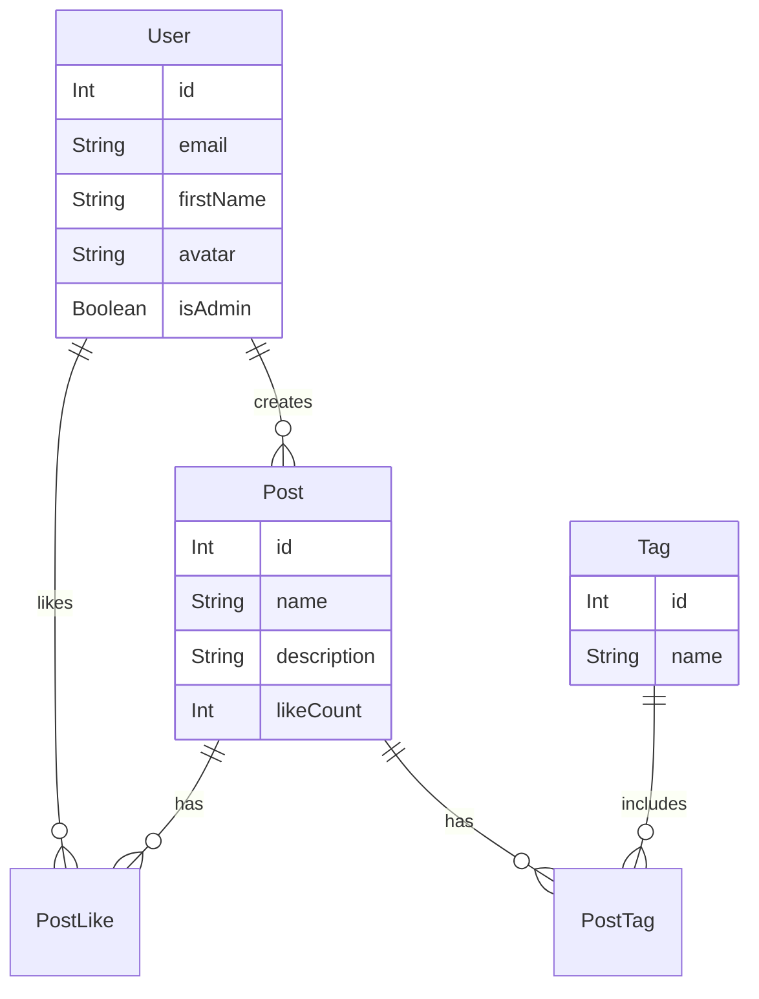

# 🪐 Luppiter Server API


> **Luppiter Server** — це потужний REST API для соціальної платформи, побудований на принципах чистої архітектури. Сервер забезпечує швидку обробку запитів, безпечну авторизацію та надійну роботу з даними.

## 🏗 Архітектура та Патерни

Проект реалізовано з використанням **3-Layer Architecture** (Controller-Service-Repository), що забезпечує слабку зв'язаність коду та легкість у тестуванні:

1.  **Controller Layer:** Приймає HTTP-запити, валідує вхідні дані та відправляє відповідь клієнту (`*.controller.ts`).
2.  **Service Layer:** Містить бізнес-логіку додатка. Тут відбуваються перевірки, обчислення та прийняття рішень (`*.service.ts`).
3.  **Repository Layer:** Відповідає виключно за пряму взаємодію з базою даних через Prisma ORM (`*.repository.ts`).

Також реалізовано патерн **Contract First**: кожен шар має чітко визначені інтерфейси (`IControllerContract`, `IServiceContract`, `IRepositoryContract`), що гарантує сувору типізацію.

## ✨ Ключові Можливості

* **🔐 JWT Authentication:** Безпечна система входу. Access Token видається на 7 днів. Middleware автоматично перевіряє валідність токена та додає `userId` до контексту запиту.
* **⚡ Transactional Likes:** Система лайків використовує транзакції бази даних (`prisma.$transaction`). Це гарантує, що лічильник лайків у пості та запис у таблиці `PostLike` завжди синхронізовані, навіть при високих навантаженнях.
* **🏷️ Smart Tags System:**
    * Підтримка створення тегів "на льоту" при публікації поста (`connectOrCreate`).
    * Окремий CRUD для керування тегами.
* **👤 User Profile & Avatar:** Логіка оновлення аватара з валідацією на сервері (перевірка довжини символів для підтримки емодзі-аватарів).
* **🛡️ Type Safety:** Повне використання TypeScript. Усі запити та відповіді типізовані через `ServiceResponse`.

## 🛠 Технологічний Стек

* **Runtime:** Node.js
* **Framework:** Express.js
* **Language:** TypeScript
* **ORM:** Prisma (Client & Migrations)
* **Database:** SQLite
* **Auth:** `bcrypt` (хешування паролів), `jsonwebtoken` (генерація токенів)
* **Env Management:** `dotenv`

## 🗄️ Database Schema

Проект використовує реляційну базу даних (SQLite) під керуванням Prisma ORM.

### 👤 User (Користувач)
* **Identity:** `id`, `email` (Unique), `password` (Hashed)
* **Profile:** `firstName`, `secondName`, `avatar` (Emoji support)
* **Role:** `isAdmin` (Boolean, default: false)
* **Relations:**
  * `createdPosts`: Список створених постів (One-to-Many)
  * `likedPosts`: Список вподобаних постів (Many-to-Many)

### 📝 Post (Публікація)
* **Content:** `id`, `name` (Title), `description`, `pic` (Image URL)
* **Stats:** `likeCount` (Cached counter for performance)
* **Relations:**
  * `createdBy`: Посилання на автора (`User`)
  * `tags`: Теги, прив'язані до поста (Many-to-Many через `PostTag`)
  * `likedBy`: Користувачі, які лайкнули пост (Many-to-Many через `PostLike`)

### 🏷️ Tag (Тег)
* **Core:** `id`, `name` (Unique string)
* **Relations:**
  * `posts`: Список постів з цим тегом

### 🔗 Join Tables (Many-to-Many)
Для оптимізації зв'язків використовуються проміжні таблиці:
* **PostTag:** Зв'язує `Post` ↔ `Tag` (Cascade delete enabled).
* **PostLike:** Зв'язує `User` ↔ `Post` (Унікальна пара `userId_postId`, щоб уникнути дублювання лайків).



## 📂 Структура Проекту

```text
server/
├── prisma/               # Схема бази даних та міграції
│   ├── database/         # SQLite файл (для dev режиму)
│   ├── migrations/       # Історія змін структури БД
│   ├── schema.prisma     # Опис моделей (User, Post, Tag...)
│   └── seed.ts           # Скрипт для наповнення БД тестовими даними
│
├── src/
│   ├── client/           # Ініціалізація PrismaClient
│   ├── config/           # Змінні середовища (env.ts)
│   ├── generated/        # Автоматично згенеровані типи Prisma
│   ├── middlewares/      # Middleware (авторизація)
│   ├── Post/             # Модуль Постів
│   │   ├── post.controller.ts
│   │   ├── post.repository.ts
│   │   ├── post.router.ts
│   │   ├── post.service.ts
│   │   └── post.types.ts
│   ├── Tag/              # Модуль Тегів (аналогічна структура)
│   ├── User/             # Модуль Користувачів (Login, Register, Me)
│   ├── server/           # Налаштування Express додатка
│   └── index.ts          # Точка входу
│
├── .env                  # Конфігурація секретів (не комітити!)
├── package.json          # Залежності
└── tsconfig.json         # Налаштування TypeScript

